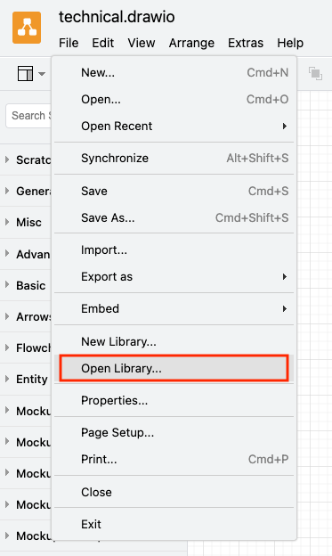

# Neptune DXP Architecture Diagrams

## Introduction

Welcome to the **Neptune DXP Architecture Diagrams** repository!

This repository serves as a centralized collection of architecture diagrams created and maintained using [Draw.io](https://drawio.com/) These diagrams provide visual representations of systems, processes, and designs relevant to Neptune Software projects and initiatives. They aim to enhance collaboration, communication, and understanding across teams by offering clear and detailed insights into the technical and functional aspects of our architecture.

**Key Features**
- Clarity in Design: Well-structured diagrams for easy understanding of complex system architectures.
- Collaboration-Ready: Optimized for teamwork, with support for updates and feedback.
- Reusable Components: Standardized elements for consistency across multiple projects.
- Version Control: Track changes and revisions seamlessly with Git.

Whether you're a developer, architect, or stakeholder, these diagrams are your go-to resource for understanding the big picture and the finer details of Neptune's system architecture.

Feel free to explore, contribute, or use these diagrams to support your work!

## Folder structure

```

├── LICENSE
├── Neptune DXP.xml
├── README.md
├── assets
│   └── import.png
├── capabilities                                            # Capablities mapping
│   ├── technical mapping.drawio
│   └── value mapping.drawio
├── examples                                                # Example Architecture diagrams
│   ├── full dxp - reference architecture.drawio
│   ├── full dxp - side by side extension scenario.drawio
│   ├── open edition - email with PDF attachment.drawio
│   ├── open edition - prototype to full app.drawio
│   ├── open edition - reference architecture.drawio
│   ├── open edition - user experience.drawio
│   ├── sap edition - offline scenario.drawio
│   └── sap edition - sap btp mobility.drawio
└── library                                                 # Draw.io Library with Neptune DXP icons
    └── Neptune DXP.xml                                 
```                                                                                                                                                                                                                                               

## Library Setup

The Neptune DXP shape library can be imported in Draw.io.

- Click `Open Library...` from the File menu.
- Open the file `Meptune DXP.xml` file from the `library` folder in this repository



### Online usage

If you are using Draw.io online via the browser you can load the `Neptune DXP` Library directly via the url parameter `clibs`.

Example:
https://app.diagrams.net/?splash=0&clibs=Uhttps%3A%2F%2Fgithub.com%2Fneptune-software%2Fdxp-architecture-diagrams%2Fblob%2Fmain%2Flibrary%2FNeptune%2520DXP.xml

## Support, Feedback, Contributing

This project is open to feature requests/suggestions, bug reports etc. via [GitHub issues](https://github.com/neptune-software/dxp-architecture-diagrams/issues). Contribution and feedback are encouraged and always welcome. 

## License

This project is licensed under the MIT License. See the [LICENSE](./LICENSE) file for more details.
 
### Third-Party Licenses

This project uses icons from the [SAP BTP Solution Diagram Guidelines](https://github.com/SAP/btp-solution-diagrams) which is licensed under the Apache 2.0 License. For more details see [LICENSE](./LICENSE) file.
